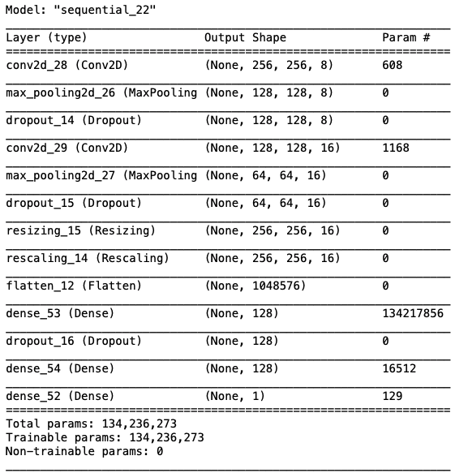
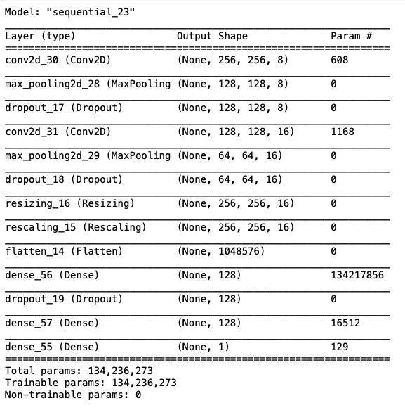
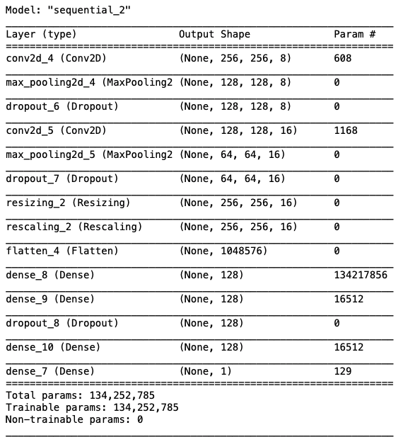

# Walk Through of Development Changes and Findings/Results

## Model 1:

### Overview

    
### Config
- dense_layer_1
    - Nodes: 128
    - activation: relu
- dense_layer_2
    - Nodes: 128
    - activation: relu
- convolutional_layer_1
    - filters: 8
    - padding: Same
    - activation: relu
- convolutional_layer_2
    - filters: 8
    - padding: Same
    - activation: relu
- pooling_layer_1
    - pool_size: (2, 2)
- pooling_layer_2
    - pool_size: (2, 2)

- dropout_layer_1
    - dropout: 0.25
- dropout_layer_2
    - dropout: 0.25
- dropout_layer_3
    - dropout: 0.4

### Results:
- Epoch 10:
    - Loss: 0.1346244513988495
    - Accuracy: 0.9305555820465088

### Notes:
- Having a drop out layer between my only two connection layers may have hurt my model by stoping two layers from acting like a unit. I think I would like to add another connection layer to allow two to function as a unit, and one to pickup for over fit.
- I used only `relu` action functions maybe I shoud diversify.

## Model 2:

### Overview

### Config
- dense_layer_1
    - Nodes: 128
    - activation: sigmoid
- dense_layer_2
    - Nodes: 128
    - activation: sigmoid
- convolutional_layer_1
    - filters: 8
    - padding: Same
    - activation: sigmoid
- convolutional_layer_2
    - filters: 8
    - padding: Same
    - activation: sigmoid
- pooling_layer_1
    - pool_size: (2, 2)
- pooling_layer_2
    - pool_size: (2, 2)

- dropout_layer_1
    - dropout: 0.25
- dropout_layer_2
    - dropout: 0.25
- dropout_layer_3
    - dropout: 0.4

### Results:
Epoch 10:
    - Loss: 0.2288987785577774
    - Accuracy: 0.9120370149612427

Epoch 15:
    - Loss: 0.2909821569919586
    - Accuracy: 0.8703703880310059

### Notes:
- I wanted to see what another activation function would do to the results.
- Becase of the decrease in proformance, but realtivly low accuracy on training data relative to model 1 of (.9042 vs 1.0), I desided to see if an increase in Epoch would imporve the model. This had a negative impact.

## Model 3:

### Overview

### Config
- dense_layer_1
    - Nodes: 128
    - activation: relu
- dense_layer_2
    - Nodes: 128
    - activation: relu
- dense_layer_3
    - Nodes: 128
    - activation: relu
- convolutional_layer_1
    - filters: 8
    - padding: Same
    - activation: relu
- convolutional_layer_2
    - filters: 8
    - padding: Same
    - activation: relu
- pooling_layer_1
    - pool_size: (2, 2)
- pooling_layer_2
    - pool_size: (2, 2)

- dropout_layer_1
    - dropout: 0.25
- dropout_layer_2
    - dropout: 0.25
- dropout_layer_3
    - dropout: 0.4

### Results:
- Epoch 10:
    - Loss: 0.1392
    - Accuracy: 0.9306

### Notes:
- Unfortunately test seems to have no substatal affect on the outcome.
